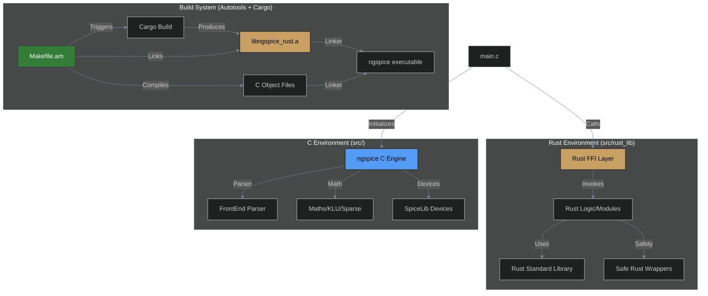

# ngspice-rust Hybrid Architecture

This document describes how ngspice works and the high-level architecture of the hybrid simulator, detailing how the legacy C engine interoperates with new Rust components.

## How ngspice Works

ngspice is a General Purpose Circuit Simulator. It solves the mathematical equations that describe electronic circuits using **Modified Nodal Analysis (MNA)**.

### The Simulation Pipeline

```mermaid
%%{init: {'theme': 'dark', 'themeVariables': { 'primaryColor': '#2d333b', 'primaryTextColor': '#adbac7', 'primaryBorderColor': '#444c56', 'lineColor': '#768390', 'secondaryColor': '#22272e', 'tertiaryColor': '#2d333b'}}}%%
graph LR
    Input[Netlist .cir] --> Parser[Frontend Parser]
    Parser --> Setup[Circuit Setup / Matrix Allocation]
    
    subgraph Engine[Simulation Engine]
        Setup --> Loop[Analysis Loop: DC/AC/Transient]
        Loop --> Load[Device Modeling: Equations]
        Load --> Solve[Matrix Solver: KLU/Sparse]
        Solve --> |Newton-Raphson| Loop
    end
    
    Loop --> Output[Post-Processor / Plotting]
    
    style Engine fill:#1c2128,stroke:#444c56
    style Input fill:#2d333b,stroke:#adbac7
    style Output fill:#2d333b,stroke:#adbac7
```

1.  **Frontend Parser**: Reads the SPICE deck (netlist). It identifies components (R, L, C, transistors) and their connections (nodes).
2.  **Circuit Setup**: Constructs the internal data structures and allocates the large Sparse Matrix used for nodal analysis.
3.  **Device Modeling (Loading)**: For every iteration, ngspice calculates the current and conductance of every device based on their physical models (e.g., BSIM4 for MOSFETs). These values are "loaded" into the matrix.
4.  **Matrix Solver**: The engine solves the system `Ax = b`.
    *   **Linear**: Solved directly.
    *   **Non-linear**: Solved using the **Newton-Raphson** algorithm, which linearizes the circuit and iterates until convergence.
5.  **Analysis Loop**:
    *   **DC**: Finds the steady-state operating point.
    *   **Transient**: Steps through time, solving the circuit at each time point.
    *   **AC**: Calculates frequency response by linearizing around the DC point.

---

## Hybrid System Overview

The project follows a **Shared-Binary Hybrid Architecture**. The core simulation engine remains in C, while new features or refactored modules can be implemented in Rust.

## Key Components

### 1. The Orchestrator (C)
- **`src/main.c`**: The primary entry point. It handles command-line arguments and initializes the simulation environment.
- It includes `extern` declarations for Rust functions, allowing it to boot up Rust modules during startup.

### 2. The Rust Library (`src/rust_lib`)
- **`lib.rs`**: The bridge. Functions here are marked `#[no_mangle]` and `pub extern "C"` to ensure they are visible to the C linker.
- **`Cargo.toml`**: Configured as a `staticlib`. This tells Rust to bundle all its dependencies (including the standard library) into a single `.a` file that C can understand.

### 3. The Build Pipeline
1. **Developer runs `make`**:
2. **Autotools** detects that `ngspice` depends on `libngspice_rust.a`.
3. **Cargo** is invoked to compile the Rust code into a static object.
4. **GCC/Linker** combines the thousands of C object files with the single Rust static library.
5. **Output**: A single, standalone binary containing both C and Rust machine code.

## Data Flow (FFI)

Data is passed between C and Rust using C-compatible types:
- **Integers/Floats**: Passed directly by value.
- **Strings**: Passed as `*const c_char` (pointers). Rust manually handles conversion to `String`.
- **Memory**: Memory allocated in Rust must be freed by Rust to avoid allocator conflicts.
