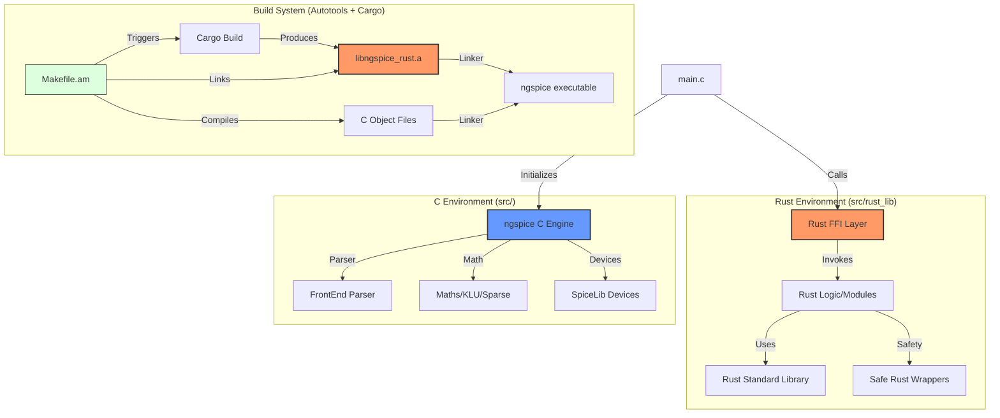

# ngspice-rust Hybrid Architecture

This document describes the high-level architecture of the hybrid ngspice simulator, detailing how the legacy C engine interoperates with new Rust components.

## System Overview

The project follows a **Shared-Binary Hybrid Architecture**. The core simulation engine remains in C, while new features or refactored modules are implemented in Rust. These two worlds meet at the **Foreign Function Interface (FFI)** boundary.

## Key Components

### 1. The Orchestrator (C)
- **`src/main.c`**: The primary entry point. It handles command-line arguments and initializes the simulation environment.
- It now includes `extern` declarations for Rust functions, allowing it to boot up Rust modules during startup.

### 2. The Rust Library (`src/rust_lib`)
- **`lib.rs`**: The bridge. Functions here are marked `#[no_mangle]` and `pub extern "C"` to ensure they are visible to the C linker.
- **`Cargo.toml`**: Configured as a `staticlib`. This tells Rust to bundle all its dependencies (including the standard library) into a single `.a` file that C can understand.

### 3. The Build Pipeline
1. **Developer runs `make`**:
2. **Autotools** detects that `ngspice` depends on `libngspice_rust.a`.
3. **Cargo** is invoked to compile the Rust code into a static object.
4. **GCC/Linker** combines the thousands of C object files with the single Rust static library.
5. **Output**: A single, standalone binary containing both C and Rust machine code.

## Data Flow (FFI)

Data is passed between C and Rust using C-compatible types:
- **Integers/Floats**: Passed directly by value.
- **Strings**: Passed as `*const c_char` (pointers). Rust must manually handle the conversion from C strings to Rust `String` types.
- **Memory Management**: Memory allocated in Rust and passed to C must usually be freed by a corresponding Rust function to avoid allocator mismatches.
